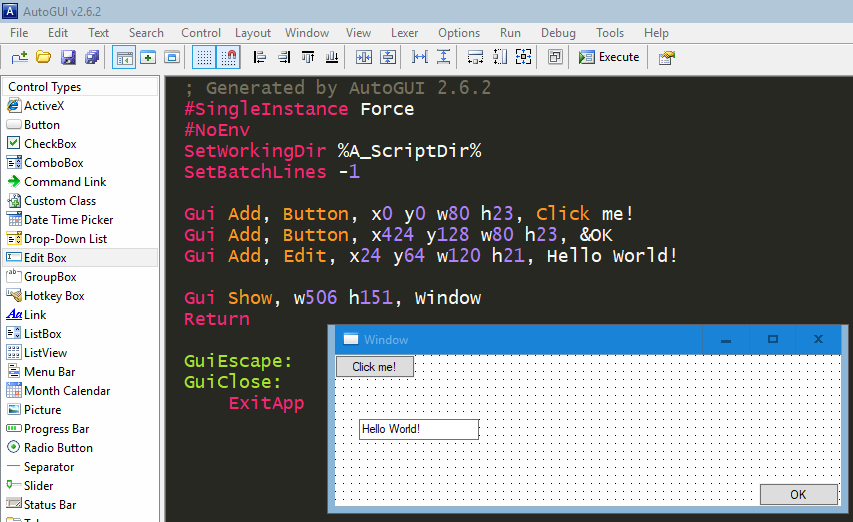
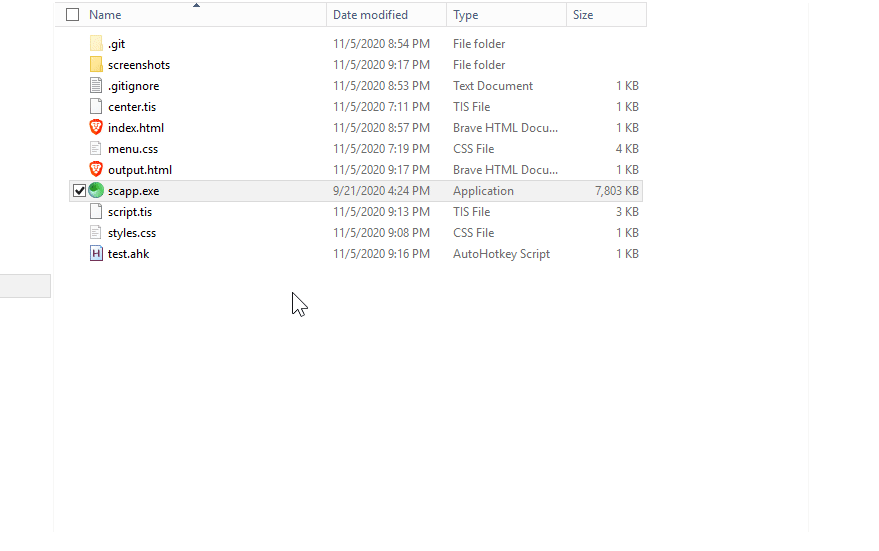

# AHK to Sciter

Transpile the output of AutoGUI for use with Sciter.

Basically, port `.ahk` over to `.html`.

## Example

1. Design window with the WYSIWYG interface of AutoGUI.

2. Convert the `.ahk` file created with the previous step into an `.html` file and open it with Sciter.

;

## Warning

This is just a proof of concept.  It barely does anything except what was required to record the screenshots!